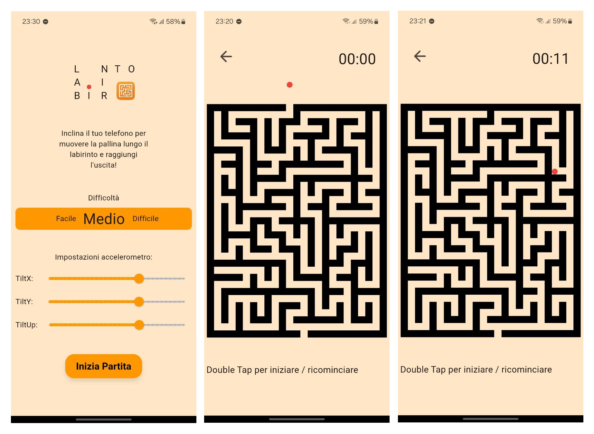

# Labirinto

Labirinto - In questo gioco mobile sarai tu, muovendo il dispositivo, a spostare la pallina all'interno del labirinto verso l'uscita.
Ne sarai in grado? Se sei stanco dei classici labirinti noiosi questo gioco fa al caso tuo!

## Screenshots


## Svolgimento del gioco

Nella HomePage il giocatore può scegliere la difficoltà con degli swipe, che corrisponde alla grandezza del labirinto, tra:
* Facile
* Medio
* Difficile

Inoltre, ha a disposizione degli slider per regolare la velocità con cui preferisce muovere la pallina in base all'inclinazione del dispositivo. In particolare:
* TiltX: velocità di movimento in orizzontale
* TiltY: velocità di discesa
* TiltUp: velocità di salita

Una volta completata la configurazione l'utente può iniziare la partita e verrà reindirizzato alla pagina del labirinto.
Con un Double Tap inizia la partita e parte il cronometro, con i successivi Double Tap la partita si resetta.

## Scelte di sviluppo

Il labirinto consiste in una matrice di valori booleani (true = muro, false = cella libera) e i percorsi vengono generati con un algoritmo ricorsivo DFS, che assicura un percorso che porta all'uscita.
La classe MazePainter si occupa di disegnare il labirinto e la pallina ad ogni cambiamento.
Ogni 16ms viene aggiornata la posizione della pallina in base all'inclinazione del dispositivo e viene effettuato il controllo che non stia entrando in un bordo.
In questo secondo caso semplicemente la pallina viene allineata adiacente al muro.
Dividendo l'altezza e la larghezza del labirinto rispettivamente per il numero di righe e colonne si riescono ad ottenere le dimensioni delle celle. È proprio su queste celle che si effettuano i confronti, si trova in quale cella la pallina si posizionerà e si controlla che in quella cella non sia presente un muro, in caso si riporta alla cella precedente posizionandola in modo adiacente al muro.

All'inizio della partita, la pallina parte da una posizione sopraelevata e al primo DoubleTap cade attraverso un buco sulla parte superiore del labirinto fino a raggiungere il primo "pavimento". Poi l'entrata si chiude. Ad ogni restart questa caduta iniziale si ripete.

Anche per il cronometro è stato utilizzato un Timer che ogni secondo lo aggiorna.

L'app utilizza l'accelerometro del dispositivo e i valori di accelerazione vengono ascoltati in tempo reale tramite lo stream accelerometerEventStream() fornite dalla libreria sensors_plus.

Sono stati utilizzati dei GestureDetector per:
* Il selettore della difficoltà, in questo caso controlla i drag orizzontali, calcola la velocità e se è negativa fa uno shift delle difficoltà (in widget AnimatedPositioned) a sinistra, altrimenti a destra
* Gestire inizio e restart del gioco ascoltando i Double Tap

## Requisiti

- Flutter SDK
- Android Studio
- Visual Studio Code

L'ambiente deve essere configurato correttamente, il seguente comando da digitare sul prompt dei comandi fornirà  indicazioni sullo stato configurazione:
```bash
flutter doctor
```

## Download del progetto

È possibile scaricare questo progetto selezionando il percorso desiderato dal prompt dei comandi e digitando:
```bash
git clone https://github.com/LeoF-07/Labirinto.git
```
L'applicazione client funziona per i dispositivi Android.
Se i [Requisiti](#Requisiti) sono rispettati sarà  possibile modificare il progetto con Android Studio o Visual Studio Code ed emularlo.


## Emulazione dell'applicazione

L'emulazione dell'applicazione può avvenire o con i dispositivi virtuali che Android Studio mette a disposizione oppure su un dispositivi fisico personale. Se si sceglie di eseguire il debug con questa seconda opzione è necessario seguire questi passaggi:
1. Collegare il dispositivo al PC tramite un cavo USB.
2. Assicurarsi che il **debug USB** sia attivo nelle Opzioni sviluppatore del dispositivo Android.
3. Verificare che il dispositivo sia riconosciuto e ottenere l'id del dispositivo con:
```bash
futter devices
```
4. Digitare nel prompt dei comandi all'interno della cartella del progetto:
```bash
flutter run -d <device-id>
```

## Creazione APK

L'APK può essere creato direttamente del Menu di Android Studio nella sezione Build, oppure è sufficiente digitare questo comando nel prompt dei comandi all'interno della cartella del progetto:
```bash
flutter build apk --release
```

Nella sezione [Releases](https://github.com/LeoF-07/Labirinto/releases) della repository è presente l'APK da scaricare senza bisogno di aprire il progetto con un IDE.


Trasferendo l'apk su un dispositivo Android potrà  essere scaricato e l'applicazione sarà  pronta all'uso.


## Autore

Leonardo Fortin